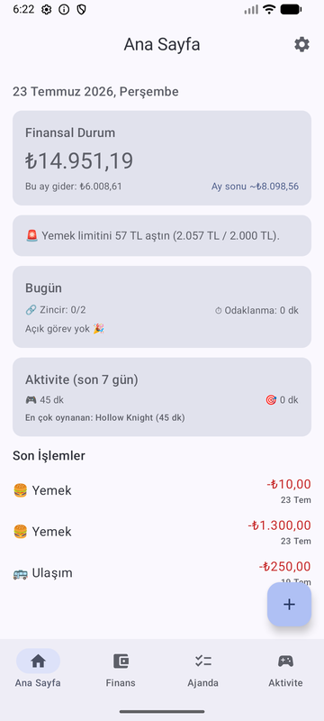
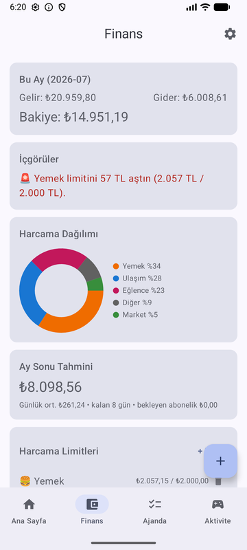
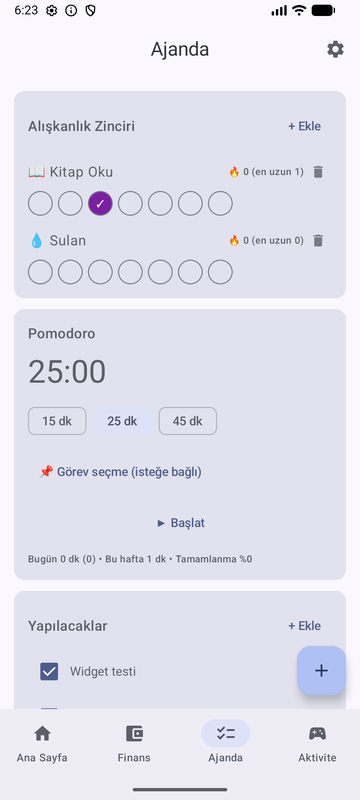
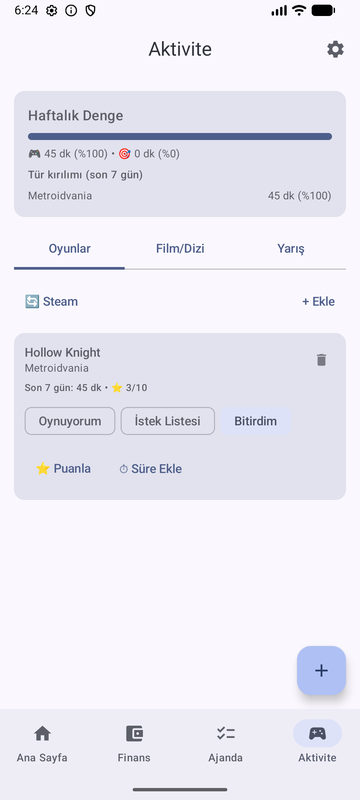
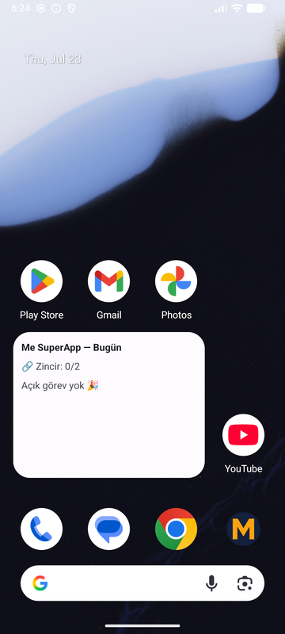

# Me SuperApp

A personal "life dashboard" Android app — finance tracking, agenda & habits, and an activity archive — built with **Kotlin + Jetpack Compose** on the UI side and an **embedded Python analytics engine** (pandas via [Chaquopy](https://chaquo.com/chaquopy/)) doing the number crunching on-device.

> Offline-first: all data lives on the device in SQLite (Room). No accounts, no cloud.

## Why embedded Python?

Data analysis is my home turf, so the analytics layer (spending breakdowns, month-end forecasts, insight generation, play/work balance) is written as a plain Python package with pandas. The same package:

- runs **inside the APK** through Chaquopy at runtime,
- is tested **on the desktop with pytest** — no device or emulator needed.

The Kotlin ↔ Python surface is a single function: `run(fn, payload_json) -> result_json`. Kotlin owns the database and all writes; Python is a pure, stateless calculator.

```
┌────────────── Compose UI (Material 3) ──────────────┐
│ Dashboard │ Finance │ Agenda │ Activity │ Quick-add │
└──────────────────────┬───────────────────────────────┘
                 ViewModel (StateFlow)
                       │
                Repository (Kotlin)
          ┌────────────┼────────────────┐
     Room (SQLite)  Retrofit         WorkManager
                       │
        AnalyticsEngine (Chaquopy bridge)
                       │  JSON in → JSON out
        Python package: analytics/ (pandas)
```

## Modules

| Module | Status | Highlights |
|---|---|---|
| Finance | ✅ v1 | income/expense tracking, category pie, month-end forecast, budget limits, subscriptions, savings goals, rule-based insights (generated in pandas), JSON backup/restore |
| Dashboard | ✅ v1 | today at a glance, finance snapshot, habit/task/focus summary, quick-add sheet |
| Agenda | ✅ v1 | habit chains with streaks (pandas), to-dos, pomodoro as a foreground service with task pairing, GitHub commit streak (GraphQL) |
| Activity archive | ✅ v1 | Steam playtime sync (daily WorkManager snapshot + pandas diff), manual game log with RAWG metadata, movie/TV logging via TMDB, sim-racing lap journal, weekly play/work balance & genre breakdown (pandas) |
| Widget & notifications | ✅ v1 | Glance home-screen widget (today's open tasks + habit streak, tap-to-complete), budget-exceeded alerts, a daily digest for unticked habits & subscriptions due today (WorkManager) |
| Polish | ✅ v1 | Material You dynamic color with a hand-picked light/dark fallback palette, animated progress bars, friendly empty states |

## Screenshots

<p>
  
  
  
  
  
</p>

## Tech stack

Kotlin 2.3 · Jetpack Compose (Material 3) · Hilt · Room · DataStore · OkHttp · WorkManager · Glance (home screen widget) · Coil 3 · kotlinx.serialization · Chaquopy 17 (Python 3.13, pandas) · GitHub Actions

**Design system:** brand Navy + Amber palette (full light/dark Material 3 scheme) with an in-app toggle for Material You dynamic color, per-module accent colors, chunky rounded shapes, and a playful type pairing — Fredoka (headings/numbers) + Nunito (body). Both fonts are bundled and licensed under the [SIL Open Font License 1.1](docs/fonts-license.md).

## Development

```bash
# Python analytics tests (desktop, no device needed)
pip install pandas pytest
pytest

# Android build
./gradlew assembleDebug
```

Money is stored as integer kuruş (minor units) — never floats. API keys (GitHub/Steam/TMDB/RAWG) are entered in-app and stored on-device only.
